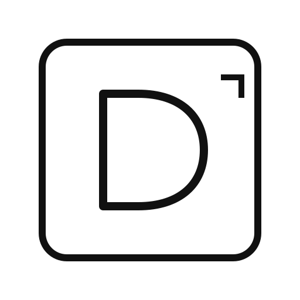

<p align="center">
  
</p>

<h1 align="center">Designly</h1>

<p align="center">
  <strong>Design Neural Mesh & Commercial Art Director — for ChatGPT & Codex.</strong><br/>
  13 Focused Skills · 8 Custom Codex Agents · Typed Contracts · Signal Priority · Visual QA Loops
</p>

<p align="center">
  
  
  
  
  
  
</p>

---

## What is Designly v4.0.0?

Designly v4 transforms commercial art direction from a single monolithic skill into a **Design Neural Mesh**: a high-precision network of **13 discoverable Skills** and **8 custom Codex agents** coordinated by **Designly Director**.

The system operates via typed, schema-validated signal packets (`DesignContext`, `DesignSignalPacket`, `DesignLock`, `RevisionRequest`), resolves conflicting requirements through a deterministic **11-level Signal Priority table**, and re-routes QA defects exclusively to the single responsible specialist rather than regenerating the full pipeline.

```text
USER BRIEF
    │
    ▼
[designly-director] ── locks constraints (P1 user, P2 brand)
    │
    ├─► [creative-strategy] (Audience, Message Hierarchy, Concept Territory)
    ├─► [brand-intelligence] (Brand Rules, Logo Clearspace, Product Fidelity)
    └─► [taste-engine] <──► [reference-memory] (Transferable Taste Rules, Stable REF IDs)
    │
    ▼ (merge signal packets & enforce locks)
[composition-director] (Grid, Hierarchy, Focal Anchor, Negative Space)
    │
    ├─► [typography-director] ──► [arabic-rtl-director] (if Arabic copy)
    ├─► [photography-director] (Camera Optics, 3-Point Light, Materials)
    ├─► [manipulation-director] (Compositing Physics, Contact Shadows)
    └─► [campaign-dna] (Multi-asset continuity across formats)
    │
    ▼
[prompt-compiler] (Model-specific execution syntax for Flux, Midjourney, DALL-E)
    │
    ▼
[visual-qa] ──► PASS: Final Signoff (Score ≥ 92 + Category Floors)
    │
    └─► FAIL: RevisionRequest ──► routes ONLY to failing specialist node
```

---

## 13 Modular Skills

Every capability is exposed as an independent, discoverable Skill with its own `agents/openai.yaml` interface metadata:

| Skill | Slug | Primary Role |
| :--- | :--- | :--- |
| **Designly Director** | `designly-director` | Lead orchestrator, brief intake, lock enforcement, conflict resolution, final approval. |
| **Creative Strategy** | `creative-strategy` | Marketing brief deconstruction, audience psychology, message hierarchy, concept territories. |
| **Brand Intelligence** | `brand-intelligence` | Brand manuals, logo clearspace, color formulas, product packaging fidelity, Brand-Off test. |
| **Taste Engine** | `taste-engine` | Evidence-backed transferable taste extraction, reference job allocation, originality guard. |
| **Reference Memory** | `reference-memory` | Local-first persistence, stable `REF-####` IDs, scoped feedback ledger, preference recall. |
| **Composition Director** | `composition-director` | Spatial grids, focal hierarchy (1 hero anchor), negative space balance, preflight checks. |
| **Typography Director** | `typography-director` | Typographic scale, headline measure, semantic line breaks, legibility contrast ratios. |
| **Photography Director** | `photography-director` | Camera focal lengths, aperture/shutter physics, 3-point studio lighting, material finishes. |
| **Manipulation Director** | `manipulation-director` | Compositing physics, contact shadows, directional reflections, scale/perspective integration. |
| **Arabic RTL Director** | `arabic-rtl-director` | Arabic-first visual architecture, native RTL eye path, calligraphy glyph fidelity, bidi balance. |
| **Campaign DNA** | `campaign-dna` | Multi-asset continuity across 1:1, 9:16, 16:9 formats with deliberate creative variation. |
| **Prompt Compiler** | `prompt-compiler` | Translates approved specs into model syntax (Flux, Midjourney, DALL-E) and inpainting masks. |
| **Visual QA** | `visual-qa` | 10-point critique, category floors, AI-slop hard veto, targeted `RevisionRequest` routing. |

---

## 8 Custom Codex Agents

Configured in `.codex/agents/*.toml` with bounded tool permissions and strict concurrency controls:

| Agent | Config | Execution Mode | Responsibilities |
| :--- | :--- | :--- | :--- |
| `designly_director` | `designly-director.toml` | Orchestration | Owns `DesignContext`, spawns subagents, merges signals, enforces locks. |
| `strategy_planner` | `strategy-planner.toml` | Read-only | Audience insight, primary message capture, concept territories. |
| `brand_guardian` | `brand-guardian.toml` | Read-only / Veto | Brand guideline compliance, logo protection, product fidelity vetoes. |
| `taste_analyst` | `taste-analyst.toml` | Read-only | Reference deconstruction into transferable rules, taste profile synthesis. |
| `structure_critic` | `structure-critic.toml` | Read-only | Preflight of grid, visual weight, negative space, and typographic measure. |
| `craft_director` | `craft-director.toml` | Read-only | Camera optics, 3-point lighting setups, compositing physics. |
| `arabic_visual_director` | `arabic-visual-director.toml` | Read-only / Veto | RTL layout flow, exact Arabic copy protection, glyph connection audits. |
| `visual_reviewer` | `visual-reviewer.toml` | Read-only / Gate | Independent scoring, category floors, AI-slop vetoes, revision routing. |

---

## Signal Priority & Conflict Resolution

When signals or recommendations conflict, the Director resolves them using strict priority ranking:

1. **User Exact Constraints** (Priority 1 — Immutable)
2. **Documented Brand Rules** (Priority 2 — Immutable brand guidelines & logo formulas)
3. **Safety & Cultural Hard Gates** (Priority 3 — Arabic glyph connections, RTL flow, legal)
4. **Primary Communication Job** (Priority 4 — 3-second message capture)
5. **Hierarchy & Composition** (Priority 5 — 1 primary focal anchor, grid alignment)
6. **Accessibility & Legibility** (Priority 6 — Contrast ratio ≥ 4.5:1, readable measure)
7. **Campaign Continuity** (Priority 7 — Visual DNA consistency across formats)
8. **Craft Realism** (Priority 8 — Contact shadows, lighting consistency, camera physics)
9. **Explicit User Taste Preference** (Priority 9 — Scoped likes/dislikes in Reference Memory)
10. **Inferred Taste Preference** (Priority 10 — Extracted reference tendencies)
11. **Decorative Finish** (Priority 11 — Ambient particles, subtle flares)

---

## Repository Structure

```text
Designly/
├── .codex-plugin/
│   └── plugin.json                    # Marketplace manifest (v4.0.0)
├── .codex/
│   ├── config.toml                    # Multi-agent concurrency & runtime config
│   └── agents/                        # 8 Custom Codex Agent definitions (.toml)
├── shared/
│   ├── contracts/                     # Typed JSON Schemas (Draft 2020-12) & Routing Graph
│   │   ├── design-context.schema.json
│   │   ├── signal-packet.schema.json
│   │   ├── design-lock.schema.json
│   │   ├── revision-request.schema.json
│   │   └── routing-graph.json
│   ├── references/                    # Shared design principles & knowledge modules
│   └── scripts/                       # Mesh validators, router, interface & agent validators
├── skills/                            # 13 Independent Discoverable Skills
│   ├── designly-director/
│   ├── creative-strategy/
│   ├── brand-intelligence/
│   ├── taste-engine/
│   ├── reference-memory/
│   ├── composition-director/
│   ├── typography-director/
│   ├── photography-director/
│   ├── manipulation-director/
│   ├── arabic-rtl-director/
│   ├── campaign-dna/
│   ├── prompt-compiler/
│   └── visual-qa/
├── evals/
│   ├── baseline/                      # v3.2.1 parity regression baseline
│   ├── conflicts/                     # 11 Cross-skill conflict & adversarial fixtures
│   ├── handoffs/                      # Typed contract & agent tests
│   ├── routing/                       # Skill catalog trigger classification tests
│   ├── visual/                        # Visual QA category floor & revision tests
│   └── plugin-benchmark.json          # 10-group Plugin Eval benchmark
├── assets/                            # Plugin logo, composer icon, and wordmark SVGs
└── tools/                             # Public plugin validator & deterministic packager
```

---

## Verification & Validation Suite

```bash
# 1. Validate shared contracts and routing mesh
python3 shared/scripts/validate_mesh.py

# 2. Validate all 13 Skill interfaces and SKILL.md frontmatter
python3 shared/scripts/validate_skill_interfaces.py

# 3. Validate Codex multi-agent TOML configs
python3 shared/scripts/validate_agent_configs.py

# 4. Run baseline parity test
python3 evals/baseline/test_monolith_parity.py

# 5. Run Skill catalog trigger tests
python3 evals/routing/test_skill_catalog.py

# 6. Run typed contract handoff tests
python3 evals/handoffs/test_contracts.py
python3 evals/handoffs/test_agents.py

# 7. Run Visual QA and revision routing tests
python3 evals/visual/test_revision_router.py

# 8. Run 11 cross-skill conflict & adversarial evaluations
python3 evals/run_mesh_evals.py

# 9. Validate public plugin compliance
python3 tools/validate_public_plugin.py .
```

---

## Deterministic Packaging

```bash
# Build deterministic ZIP package A
python3 tools/package_plugin.py . /tmp/designly-v4-a.zip

# Build deterministic ZIP package B
python3 tools/package_plugin.py . /tmp/designly-v4-b.zip

# Verify byte-identical SHA256 checksums
shasum -a 256 /tmp/designly-v4-a.zip /tmp/designly-v4-b.zip
```

---

## Author

**Mamdouh Abo Ammar** — [github.com/imMamdouhaboammar](https://github.com/imMamdouhaboammar)
